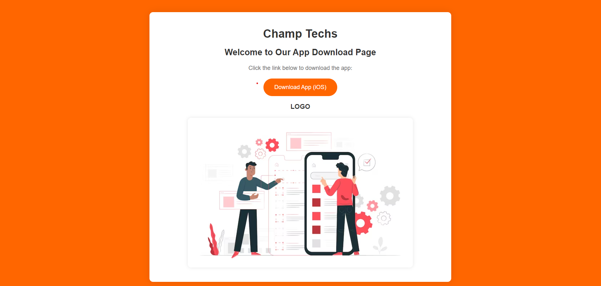

# iOS App Distribution with Nginx on AWS EC2

This repository contains a guide on how to distribute an iOS app using an AWS EC2 instance and Nginx as the web server.

## Overview

When distributing iOS apps outside the App Store, it's essential to have a reliable method for sharing app files with clients or testers. This guide provides step-by-step instructions on setting up an AWS EC2 instance and configuring Nginx to serve IPA files, Plist files, and associated assets.

## Table of Contents

- [Prerequisites](#prerequisites)
- [Step 1: Preparing Files](#step-1-preparing-files)
- [Step 2: Nginx Configuration](#step-2-nginx-configuration)
- [Step 3: Restart Nginx](#step-3-restart-nginx)
- [Step 4: Testing](#step-4-testing)
- [Step 5: Maintenance](#step-5-maintenance)

## Prerequisites

Before starting, ensure you have the following:

- An AWS account with access to EC2 services.
- Basic knowledge of setting up and configuring AWS EC2 instances.
- Familiarity with Nginx configuration.

## Step 1: Preparing Files

1. **Place Files in Correct Directories**: Ensure that the IPA file (`xyz.ipa`), Plist file (`manifest.plist`), and image/assets files (`abc.png`) are located in the appropriate directories on your server. i.e. inside /var/www/

## Step 2: Nginx Configuration

1. **Open Nginx Configuration File**: Use a text editor to open your Nginx configuration file (`/etc/nginx/sites-available/default`).
```bash
   server {
    server_name xyz.com;
    root /var/www;
    ...
}
```
3. **Update Server Block**: Configure the `server` block to serve files from the correct directories.
4. **Configure Location Blocks**: Add location blocks to serve the IPA, Plist, and image files.
``` 
   server {
    ...

    # Serve IPA and plist files
    location = /ipa/xyz.ipa {
        alias /var/www/xyz.ipa;
    }
    location = /manifest.plist {
        alias /var/www/manifest.plist;
    }

    # Serve images files
    location ~ ^/images/(?<image_name>.+\\.(jpg|jpeg|png|gif))$ {
        alias /var/www/assets/images/$image_name;
    }
}
```
6. **Save Changes**: Save the changes to the Nginx configuration file.

## Step 3: Restart Nginx

Restart Nginx to apply the changes:

```bash
sudo systemctl restart nginx
```

## Step 4: Testing

1. **Test File Access**:
    - Access the IPA file at `https://xyz.com/ipa/xyz.ipa`, the Plist file at `https://xyz.com/manifest.plist`, and the image file at `https://xyz.com/images/abc.png` in your web browser to ensure they load correctly.
2. **Verify Installation Link**:
    - Generate an installation link using the Plist file URL (e.g., `itms-services://?action=download-manifest&url=https://xyz.com/manifest.plist`) and test it on an iOS device to confirm that the app can be installed successfully.
## Step 5: Maintenance

- Regular Checks: Periodically check that the files are accessible, and Nginx is serving them correctly.
- File Updates: When updating the app or changing files, ensure that the new files are placed in the correct directories and Nginx configuration is updated accordingly.

## Step 6: Create a basic Static Website(optional for better presentation)



## Conclusion

When distributing an iOS app using this method, clients or testers will need to provide their Unique Device Identifier (UDID) to the developer. The developer will then create a provisioning profile that includes these UDIDs and generate a manifest.plist file containing information about the app. This manifest.plist file is hosted on the server and contains details such as the app's bundle identifier, version, and download URL for the IPA file. Clients or testers can then install the app by opening a special installation link (itms-services://) on their iOS device.

## Contributing
Contributions are welcome! If you find any issues or have suggestions for improvement, feel free to open an issue or create a pull request.

